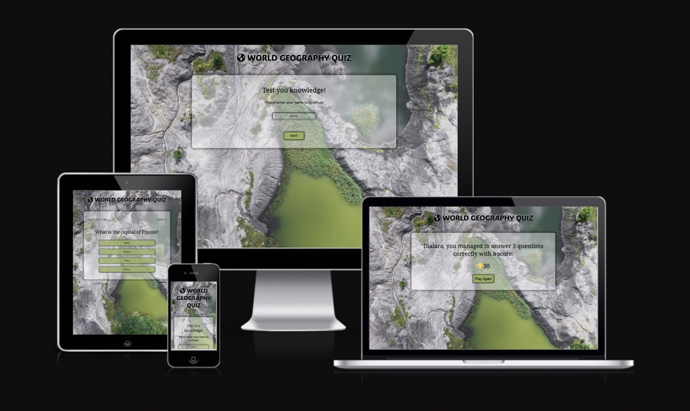
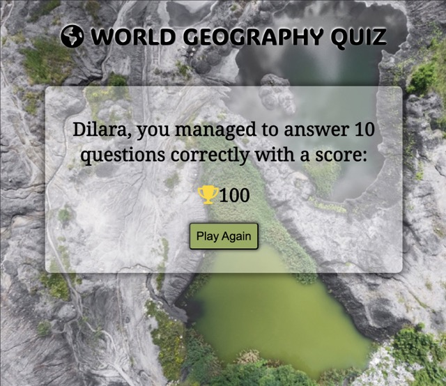
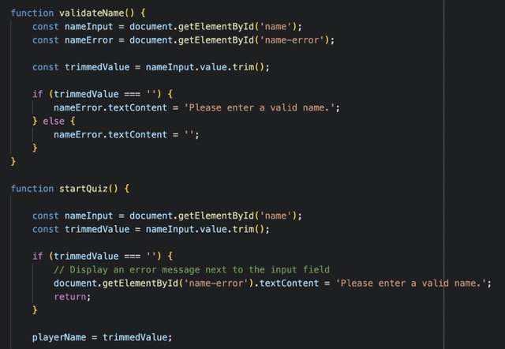
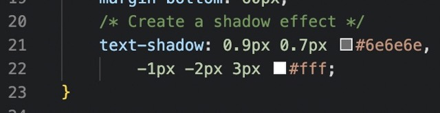

# World Geography Quiz

Visit the deployed site: [World Geography Quiz](https://dilaraucar.github.io/world-geography-quiz/)

---

## CONTENTS

- [World Geography Quiz](#world-geography-quiz)
  - [CONTENTS](#contents)
  - [Introduction](#introduction)
    - [Purpose and Target Audiance](#purpose-and-target-audiance)
  - [Features](#features)
    - [Start Section](#start-section)
    - [Quiz Section](#quiz-section)
    - [Result Section](#result-section)
    - [Features Left to Implement](#features-left-to-implement)
  - [Testing](#testing)
    - [Validator Testing](#validator-testing)
  - [Fixed Bugs](#fixed-bugs)
  - [Deployment](#deployment)
  - [Credits](#credits)
    - [Code used](#code-used)
    - [Content](#content)
    - [Media](#media)

---

## Introduction

The World Geography Quiz is a multiple choice online quiz testing the users knowledge on different countries and there geographic. The user can put in there name in the beginning of the quiz. The user gets feedback on the number of questions and the score in the ongoing quiz. The user gets an overall feedback at the end of the quiz showing how they did in the quiz, how many questions they got right, there score and a button that is there if the user wants to try again.

### Purpose and Target Audiance

The purpose of the World Geography Quiz is for users who wants to play an online quiz about geography to test there knowledge.
The target audience is users who has an interest in Geography and want entertaining way to test and learn about geography online.

---

## Features

### Start Section

- Features an input field. The user is required to enter a name to continue. A submit button initiates the next section if a valid name has been entered. If user tries to continue without putting in a valid name a red text pops up as "Please enter a valid name."

### Quiz Section

- A score area displayed at the top that keeps track of the current and total number of questions, updates if the user was correct with a score number everytime user chooses an answer.
- Features the question displayed underneath the score area with four clickable option answers.
- Feedback to the user includes the change of background color of the answers when the user hovers over and the cursor changing to a pointer. These features are disabled on smaller screens and is only for larger screens with mouse.

### Result Section

- A personalized message with there name in the beginning and telling the user how many questions they got correct and there final score.
- A clickable button wich allows the user to play again.

### Features Left to Implement

- Have different levels of the game so the user can choose: basic, intermediate or advanced.
- User being able to save there scores and progress and play again with same name.
- Having different geography topics the user could choose from. For example: Capitals, Rivers, Flags etc.

---

## Testing

Testing was performed on:

devices:

- Laptop
- Iphone 11
- Iphone 14

Browsers:

- Chrome
- Firefox
- Safari

### Validator Testing

HTML

One error and one warning where returned when passing through the official [WC3 validator.](https://validator.w3.org/nu/?doc=https%3A%2F%2Fdilaraucar.github.io%2Fworld-geography-quiz%2F)

- The error was fixed by removing the action="" from the form element.

* The warning was fixed by putting in placeholder content of: Loading question...

CSS

JavaScript

- The unused variables where used in Html.

Lighthouse Score

---

## Fixed Bugs

Had some problem with the start page on the input name field. The website remained in zoom when using it on iphone safari browser. To fix this i used font-size property on input field. Code taken from this [source.](https://defensivecss.dev/tip/input-zoom-safari/#:~:text=When%20focusing%20an%20input%20in,size%3A%2016px%20to%20the%20input)

---

## Deployment

The site was deployed to GitHub pages following these steps:

1. Go to [World-Geography-Quiz Repository.](https://github.com/DilaraUcar/world-geography-quiz)
2. Navigate to the Settings, top left.
3. In settings on the left side of the screen click pages.
4. From the source section drop-down menu, select the Deploy from branch.
5. Under Branch select main and set folder to root and save.
6. once the steps are done go back to book club repository and refresh page and you'll see deployed page at the right side if you scroll down.

The live link can be viewed here: <https://dilaraucar.github.io/world-geography-quiz/>

---

## Credits

### Code used

- The focus on input field when website is first visited was inspired by the code used from the CodeInstitute learning project - Love Maths.
  

- Using the trim() to make sure the user must put in a name before continuing was recommended by my mentor Spencer Barriball. I then used google to understand the concept more and how to use it.
  

- For bug fix when website is used on Safari browser making sure the input field works correctly and as intended code was used from this [source](https://defensivecss.dev/tip/input-zoom-safari/#:~:text=When%20focusing%20an%20input%20in,size%3A%2016px%20to%20the%20input) in CSS.

- For making the header stand out more to make it easy to read i used this [source](https://www.geeksforgeeks.org/css-font-border/) for CSS used.

### Content

The web site code is my own, but I used _Google_ to find information and _ChatGPT_ to help with generating random ideas for questions and answers options to make the quiz more exciting but still being challanging for the user.

### Media

- [Fontjoy](https://fontjoy.com/) were used to generate font pairings that look good together.
- [Favicon.io](https://favicon.io/favicon-generator/) were used to generate a favicon.
- [Pexels](https://www.pexels.com/sv-se/) were used for image used.
- [Coolors](https://coolors.co/2b402b-b0c185-628a06-e3ead7-5b7740-6c7d3f-b7b8b7-d4d3d4) were used to generate colour palettes that matches the image used in background.
- [Parade](https://parade.com/1246355/marynliles/geography-trivia/) where used to find ideas for Q&A's for the quiz.
- [Geeksforgeeks](https://www.geeksforgeeks.org/css-font-border/) where used to find answers to problems I was facing when coding (example of code used in link).
